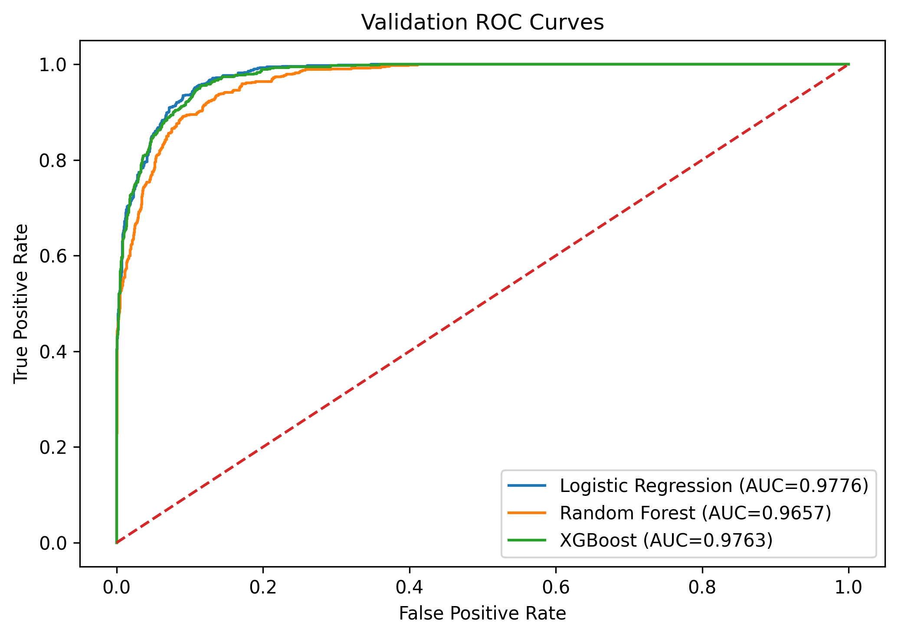
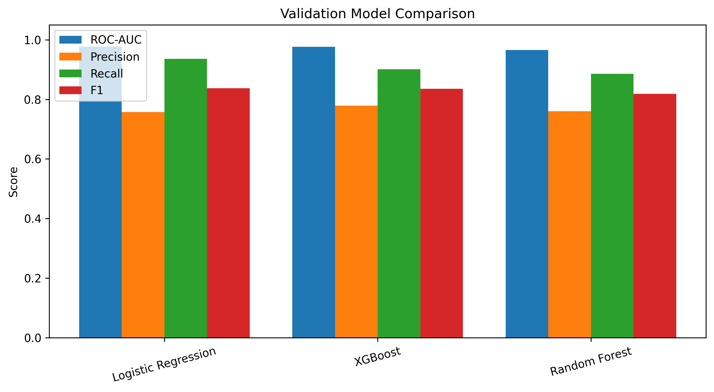
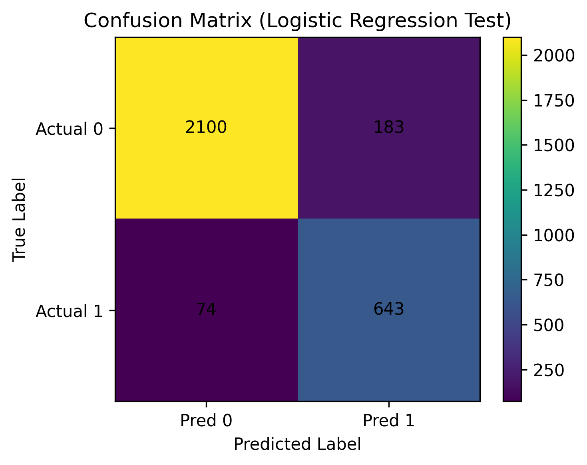
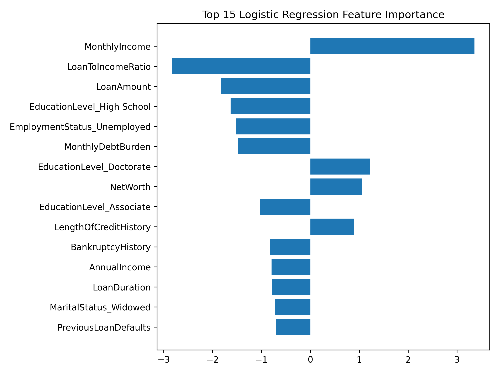

# Loan Approval Prediction using Machine Learning

## 1. Business Problem / Motivation

Financial institutions must evaluate loan applications efficiently while managing credit risk. Traditional manual review processes can be slow, inconsistent, and difficult to scale.

This project develops a machine learning-based decision support system that predicts whether a loan application is likely to be approved. The goal is to improve consistency, efficiency, and interpretability in the decision-making process.

---

## 2. Project Overview

This project builds an end-to-end machine learning pipeline for loan approval prediction.

Key components include:
- Data preprocessing and feature engineering
- Model training and comparison
- Threshold optimization
- Model evaluation
- Model interpretability
- Streamlit-based interactive demo

Final Result:
- Selected Model: Logistic Regression
- Test ROC-AUC: 0.9738
- Accuracy: 0.9143
- F1-score: 0.8334

---

## 3. Data

- Source:  
https://www.kaggle.com/datasets/lorenzozoppelletto/financial-risk-for-loan-approval

- Type: Tabular dataset  
- Size: 20,000 rows × 36 columns  

**Note:**  
The dataset is not included in this repository due to size and licensing.  
Please download it from the link above.

---

## 4. Data Preprocessing

Key preprocessing steps:
- Removed data leakage features:
  - ApplicationDate
  - InterestRate-related variables
  - RiskScore
- Train / Validation / Test split (70 / 15 / 15)
- Feature scaling for numeric variables
- One-hot encoding for categorical variables

---

## 5. Exploratory Data Analysis (EDA)

Key observations:
- Class imbalance exists (more rejections than approvals)
- Financial stability indicators strongly influence approval
- Debt-related variables are highly predictive

---

## 6. Modeling Approach

Three models were trained and compared:

- Logistic Regression (Baseline)
- Random Forest
- XGBoost (Advanced Model)

Logistic Regression was selected as the final model because:
- Highest validation ROC-AUC (0.9776)
- Strong test performance
- High interpretability

---

## 7. Model Training

Tools used:
- Python (scikit-learn, xgboost)

Cross-validation:
- 5-fold CV used for robustness

Training details:
- Models were trained using default and tuned hyperparameters
- Data was split into train, validation, and test sets
- Threshold tuning was performed using validation F1-score
---

## 8. Results

### Validation Performance

| Model | ROC-AUC | Precision | Recall | F1 |
|------|--------|----------|--------|----|
| Logistic Regression | 0.9776 | 0.7573 | 0.9358 | 0.8372 |
| XGBoost | 0.9763 | 0.7793 | 0.9010 | 0.8357 |
| Random Forest | 0.9657 | 0.7605 | 0.8856 | 0.8183 |

---

### Final Test Performance

- ROC-AUC: 0.9738
- Accuracy: 0.9143
- Precision: 0.7785
- Recall: 0.8968
- F1-score: 0.8334

---

### Visualizations

#### Validation ROC Curve


#### Model Comparison


#### Confusion Matrix


---

## 9. Model Interpretation

Logistic Regression coefficients were used for interpretability.

Key insights:
- Higher income (MonthlyIncome) increases approval probability because it reflects stronger repayment capacity.
- Higher debt burden (MonthlyDebtBurden) decreases approval probability as it indicates financial risk.
- Loan-to-income ratio is a critical feature that directly captures affordability.

These features influence the model through their coefficients:
- Positive coefficients increase approval probability
- Negative coefficients decrease approval probability

This allows the model to form a clear decision boundary based on financial stability indicators.

#### Feature Importance


---

## 10. Key Insights

- Income and debt ratio are the strongest predictors
- Employment stability significantly impacts approval
- Logistic Regression performs competitively with complex models
- Threshold tuning improves decision balance

---

## 11. Conclusion

A simple, interpretable model can achieve strong performance in loan approval prediction.

---

## 12. Future Work

- Try advanced models (LightGBM, Neural Networks)
- Improve feature engineering
- Address class imbalance further
- Enhance explainability
- Full deployment

---

## 13. Streamlit Demo Application

This project includes an interactive Streamlit app.

- Full pipeline uses all features
- Demo uses reduced features
- Designed for usability, not production

---

## 14. How to Run

### 1. Install dependencies
```
pip install -r requirements.txt
```
### 2. Run full training pipeline
```
python train_pipeline.py
```

### 3. Run demo pipeline
```
python scripts/train_pipeline_demo.py
```

### 4. Run the Streamlit app
```
streamlit run app.py
```

---

## 15. Repository Structure

```
loan-approval-prediction/
├── app.py # Streamlit application for real-time predictions
├── train_pipeline.py # Full ML pipeline (preprocessing, training, evaluation)
├── scripts/ # Demo pipeline for simplified model
├── models/ # Saved trained models (full + demo)
├── results/ # Evaluation metrics and output files
├── images/ # Visualization plots used in README
├── data/ # Dataset description (data not included)
├── notebooks/ # Explanation of notebook usage
```

## 16. Requirements

```
pip install -r requirements.txt
```
